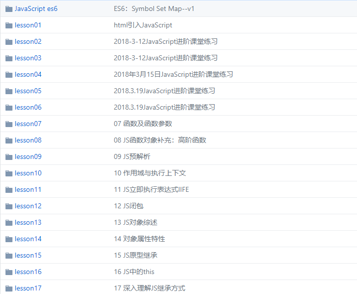

# JavaScript

JavaScript学习，该模块主要展示JavaScript相关学习资料，这些资料只不过是个人根据老师的授课内容进行整理，请大家监督，如果有什么问题可以随时进行更正。

> 说明：本仓库中的内容包括ECMAScript、BOM、DOM以及ES6相关的语法知识

## JavaScript学习大纲

#### JavaScript简介

+ JavaScript定义、JavaScript特点、JavaScript基本用法

#### JavaScript基础语法（一）

+ [JavaScript基础语法](https://github.com/fuziwang/JavaScript/blob/master/docs/02%20JavaScript%20basic.md#javascript%E5%9F%BA%E7%A1%80%E8%AF%AD%E6%B3%95)：JS语句与语句块、JS语句分类、JS注释
+ [JavaScript变量](https://github.com/fuziwang/JavaScript/blob/master/docs/02%20JavaScript%20basic.md#javascript%E5%8F%98%E9%87%8F)：JavaScript标识符、字面量、保留字
+ [JavaScript数据类型](https://github.com/fuziwang/JavaScript/blob/master/docs/02%20JavaScript%20basic.md#js%E7%9A%84%E6%95%B0%E6%8D%AE%E7%B1%BB%E5%9E%8B)：JavaScript数据类型分类、数据类型检测方法`(typeof、instanceof)`、基本类型与引用类型的区别、基本数据类型的值、数据类型转换
+ [JavaScript包装对象](https://github.com/fuziwang/JavaScript/blob/master/docs/02%20JavaScript%20basic.md#%E5%8C%85%E8%A3%85%E5%AF%B9%E8%B1%A1)
+ 补充：[基本数据类型进阶](https://github.com/fuziwang/JavaScript/blob/master/docs/Basic-DateType-advanced.md) - Number类型和String类型（方法、属性）

#### JavaScript基础语法（二）

+ [JavaScript运算符](https://github.com/fuziwang/JavaScript/blob/master/docs/03%20JavaScript%20basic2.md#javascript%E8%BF%90%E7%AE%97%E7%AC%A6)：赋值运算符、算术运算符、逻辑运算符（短路原则）、关系运算符、特殊运算符
+ [JavaScript流程控制结构](https://github.com/fuziwang/JavaScript/blob/master/docs/03%20JavaScript%20basic2.md#javascript%E6%B5%81%E7%A8%8B%E6%8E%A7%E5%88%B6%E7%BB%93%E6%9E%84)：选择和分支语句、循环语句、`break`和`continue`语句
+ [JavaScript严格模式](https://github.com/fuziwang/JavaScript/blob/master/docs/03%20JavaScript%20basic2.md#js%E4%B8%A5%E6%A0%BC%E6%A8%A1%E5%BC%8F)：严格模式的使用方法、严格模式下语法和行为的改变

#### JavaScript函数

+ [JavaScript函数的定义和调用](https://github.com/fuziwang/JavaScript/blob/master/docs/04%20JavaScript%20function.md#%E5%87%BD%E6%95%B0%E7%9A%84%E5%AE%9A%E4%B9%89%E5%92%8C%E8%B0%83%E7%94%A8)：函数简介、函数的三要素、函数的定义、函数的调用
+ [JavaScript函数的参数和返回值](https://github.com/fuziwang/JavaScript/blob/master/docs/04%20JavaScript%20function.md#%E5%87%BD%E6%95%B0%E7%9A%84%E5%8F%82%E6%95%B0%E5%92%8C%E8%BF%94%E5%9B%9E%E5%80%BC)：函数的参数的数量问题、参数类型与传递方式（值、引用）、函数的返回值
+ [JavaScript函数对象](https://github.com/fuziwang/JavaScript/blob/master/docs/04%20JavaScript%20function.md#%E5%87%BD%E6%95%B0%E5%AF%B9%E8%B1%A1)：函数对象的基本概念、函数对象的属性、函数对象的方法
+ [JavaScript高阶函数](https://github.com/fuziwang/JavaScript/blob/master/docs/04%20JavaScript%20function.md#%E9%AB%98%E9%98%B6%E5%87%BD%E6%95%B0)

#### JavaScript闭包

+ [JavaScript预解析](https://github.com/fuziwang/JavaScript/blob/master/docs/05%20JavaScript%20closure.md#javascript%E9%A2%84%E8%A7%A3%E6%9E%90)：JS的解析和执行过程、预解析主要工作（变量声明和函数声明提升）、预解析与作用域（静态词法作用域）
+ [JavaScript作用域及其特点](https://github.com/fuziwang/JavaScript/blob/master/docs/05%20JavaScript%20closure.md#js%E4%BD%9C%E7%94%A8%E5%9F%9F%E5%8F%8A%E5%85%B6%E7%89%B9%E7%82%B9)：JS作用域、JS作用域的特点
+ [JavaScript执行上下文和调用栈](https://github.com/fuziwang/JavaScript/blob/master/docs/05%20JavaScript%20closure.md#js%E6%89%A7%E8%A1%8C%E4%B8%8A%E4%B8%8B%E6%96%87%E4%B8%8E%E8%B0%83%E7%94%A8%E6%A0%88call-stack)：理解执行上下文、作用域链域执行上下文、调用栈（`Call Stack`）
+ [立即执行表达式](https://github.com/fuziwang/JavaScript/blob/master/docs/05%20JavaScript%20closure.md#js%E7%9A%84%E7%AB%8B%E5%8D%B3%E6%89%A7%E8%A1%8C%E8%A1%A8%E8%BE%BE%E5%BC%8Fiife)：`IIFE`基本概念、通过`IIFE`解决的两类问题、实际应用案例
+ [闭包](https://github.com/fuziwang/JavaScript/blob/master/docs/05%20JavaScript%20closure.md#js%E9%97%AD%E5%8C%85)：闭包的概念、闭包的常见形式、闭包的作用及应用场景

#### JavaScript对象

+ [JS对象简介](https://github.com/fuziwang/JavaScript/blob/master/docs/06%20JavaScript%20object.md#js%E5%AF%B9%E8%B1%A1%E7%AE%80%E4%BB%8B)：对象的定义、对象分类
+ [JS对象的属性](https://github.com/fuziwang/JavaScript/blob/master/docs/06%20JavaScript%20object.md#js%E5%AF%B9%E8%B1%A1%E7%9A%84%E5%B1%9E%E6%80%A7)：对象属性的分类、对象访问器属性实例
+ [对象相关操作](https://github.com/fuziwang/JavaScript/blob/master/docs/06%20JavaScript%20object.md#js%E5%AF%B9%E8%B1%A1%E7%9B%B8%E5%85%B3%E6%93%8D%E4%BD%9C)：创建对象的三种方式、对象属性的增删改查
+ [对象属性特性简介](https://github.com/fuziwang/JavaScript/blob/master/docs/06%20JavaScript%20object.md#%E5%AF%B9%E8%B1%A1%E5%B1%9E%E6%80%A7%E7%89%B9%E6%80%A7%E7%AE%80%E4%BB%8B)
+ [对象属性（数据属性）的特性](https://github.com/fuziwang/JavaScript/blob/master/docs/06%20JavaScript%20object.md#%E5%AF%B9%E8%B1%A1%E5%B1%9E%E6%80%A7%E6%95%B0%E6%8D%AE%E5%B1%9E%E6%80%A7%E7%9A%84%E7%89%B9%E6%80%A7)：对象属性（数据属性）的特性、给对象添加属性
+ [对象访问器（访问器属性）的特性](https://github.com/fuziwang/JavaScript/blob/master/docs/06%20JavaScript%20object.md#%E5%AF%B9%E8%B1%A1%E8%AE%BF%E9%97%AE%E5%99%A8%E8%AE%BF%E9%97%AE%E5%99%A8%E5%B1%9E%E6%80%A7%E7%9A%84%E7%89%B9%E6%80%A7)：对象访问器（访问器属性）的特性、综合实例
+ [属性特性描述符以及属性特性补充部分](https://github.com/fuziwang/JavaScript/blob/master/docs/06%20JavaScript%20object.md#%E5%B1%9E%E6%80%A7%E7%89%B9%E6%80%A7%E6%8F%8F%E8%BF%B0%E7%AC%A6%E5%8F%8A%E5%B1%9E%E6%80%A7%E7%89%B9%E6%80%A7%E8%A1%A5%E5%85%85%E9%83%A8%E5%88%86)：属性特性描述符的定义、对象属性的特性、`Object`与属性和属性特性相关的方法、JS对象三大特性（扩展、密封、冻结--级别逐渐升高）

#### JavaScript继承

+ [JS对象及继承方式综述](https://github.com/fuziwang/JavaScript/blob/master/docs/07%20JavaScript%20inherit.md#js%E5%AF%B9%E8%B1%A1%E5%8F%8A%E7%BB%A7%E6%89%BF%E6%96%B9%E5%BC%8F%E7%BB%BC%E8%BF%B0)：JS对象知识回顾、JavaScript语言继承方式
+ [JS对象的原型链以及基于构造函数实现的原型继承](https://github.com/fuziwang/JavaScript/blob/master/docs/07%20JavaScript%20inherit.md#js%E5%AF%B9%E8%B1%A1%E7%9A%84%E5%8E%9F%E5%9E%8B%E9%93%BE)
+ [通过构造函数模拟类-类的继承](https://github.com/fuziwang/JavaScript/blob/master/docs/07%20JavaScript%20inherit.md#js%E5%AF%B9%E8%B1%A1-%E5%AF%B9%E8%B1%A1%E5%8E%9F%E5%9E%8B%E7%BB%A7%E6%89%BF)
+ [JS继承补充部分](https://github.com/fuziwang/JavaScript/blob/master/docs/07%20JavaScript%20inherit.md#js%E7%BB%A7%E6%89%BF%E8%A1%A5%E5%85%85%E9%83%A8%E5%88%86)：静态方法和原型方法的区别、再谈对象原型的`constructor`属性、对象的公有属性和私有属性

#### [JavaScript this](https://github.com/fuziwang/JavaScript/blob/master/docs/08%20JavaScript%20this.md)

+ `JS this`简介及特点
+ `JS this`的四种应用场景以及缺陷和解决方法

#### Array

+ 数组的创建和基本操作（增删改查）

+ 稀疏数组和多维数组

+ [数组的方法和相关高阶函数](https://github.com/fuziwang/JavaScript/blob/master/docs/09%20Array.md#%E6%95%B0%E7%BB%84%E7%9A%84%E6%96%B9%E6%B3%95%E5%92%8C%E7%9B%B8%E5%85%B3%E9%AB%98%E9%98%B6%E5%87%BD%E6%95%B0)

  ```txt
  静态方法：Array.isArray()
  实例方法
  1. valueOf()，toString()
  2. push()，pop()，shift()，unshift()，splice()
  4. join()，concat()，reverse()，slice()，sort()
  5. map()，forEach()，filter()，some()，every()
  6. reduce()，reduceRight()
  7. indexOf()，lastIndexOf()
  ```

## JavaScript练习demo

JavaScript练习`demo`：https://github.com/fuziwang/JS-advanced-lessons



## JavaScript项目demo

+ [2048游戏开发](https://github.com/fuziwang/JavaScript/tree/master/src/2048)
+ [五子棋游戏开发](https://github.com/fuziwang/JavaScript/tree/master/src/%E4%BA%94%E5%AD%90%E6%A3%8B)
+ [淘宝京东商品放大效果](https://github.com/fuziwang/JavaScript/tree/master/src/%E6%B7%98%E5%AE%9D%E6%94%BE%E5%A4%A7)
+ [用户支付页面（DOM操作）](https://github.com/fuziwang/JavaScript/tree/master/src/user-money)
+ [百度搜索](https://github.com/fuziwang/JavaScript/tree/master/src/baidu-search)

## 联系我

如果你想提出一些意见，加入我的知识原地，贡献自己的一部分力量，请联系我。

- 如果你是河北师范大学的学生，请直接联系我。QQ：2622860598
- 如果你是外校学生，你只需要提供`github username` 发送到[2622860598@qq.com](mailto:209702737@qq.com)
- 如果你是技术大牛，请止步，这里是技术小白的天堂

