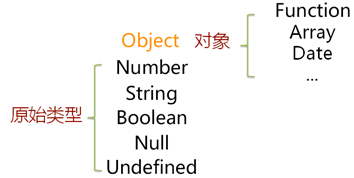
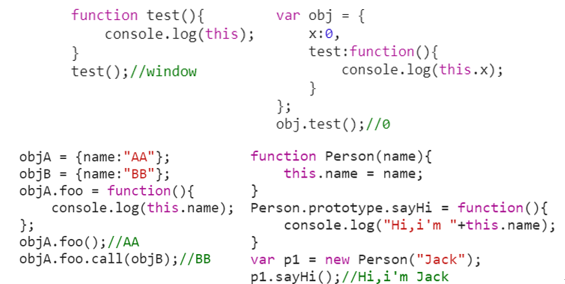

### JS对象简介

#### JS对象是什么

+ JS对象是一种**复合值**：将很多值复合在一起（包括原始类型值、对象、函数（方法））
+ JS对象是**若干无序属性的集合**，可以直接通过属性名来访问对象的属性（键值对）
+ 函数作为某一个对象的属性时，称其为该对象的方法

补充：注意键值对中，键key的数据类型是string类型，但是值value的数据类型就不一定了。

```javascript
var obj = {
  	name:3,
  	age:function(){
  		return typeof(name);
	}
}
obj.age();// 'string'
typeof(obj.name);// 'number'
```

创建对象：

```javascript
var man = {
  	name:'frewen',
  	age:20,
  	hobby:['playing ping pong','dancing'],
  	describe:function(){
  		console.log(this.name + '\'s age is ' + this.age + '.And his hobbies are ' + this.hobby[0] + ' and ' + this.hobby[1] + '.');
	}
}
// 定义完成 调用函数
man.descirbe();
// frewen's age is 20.And his hobbies are playing ping pong and dancing.
```

#### JS对象分类

+ **内置对象**（native object）由ECMAScript规范定义的对象或构造器对象（数组、函数等）


+ **宿主对象**（host object）由JS解析器所嵌入的宿主环境定义的（如：window、document）

​	注意：当前学习的宿主环境是浏览器，而不仅仅有浏览器这一个宿主环境，比如node.js环境

+ **自定义对象**（user-defined object）运行中的用户自定义JS代码创建的对象//man对象

**标准内置对象分为两类：**

1. 构造器函数对象（类对象）--类似于String、Number、Boolean等构造函数
2. 非构造器对象—类似于Math、Json等非构造函数、



```javascript
/* 使用构造器的方式相应的创建相应的对象 */
var i = new String('str');// string object
var h = new Number(1);// number object
var g = new Boolean(true);// boolean object
var j = new Object({name:"Tom"});// object object
var k = new Array([1,2,3,4]);
var l = new Date();
var m = new Error();
var n = new Function();
var o = new RegExp(/\d/);
```

**难点：**

```javascript
console.log(Function instanceof Function); // true
console.log((new Function()) instanceof Function); //true 类似于Person()这就是一个new Function
console.log((new(new Function)) instanceof Function);
//false 类似于var p = new Person();p是一个对象
```

### JS对象的属性

#### JS对象属性的分类

+ **数据属性**（property，属性），字符串的键到值的映射（包括基本类型数据、对象、函数）


+ 访问器属性（accessor，或称为访问器），访问属性的方法，注意：访问和设置时不加括号


+ 内置属性（internal property）存在与ECMAScript规范中，不能直接访问

```javascript
var o = {
  	_x:1.0,// 不成文的规定 一般约定_x表示这个属性是私有属性
  	get x(){
  		return this._x;// 如果写成 get x(){return this.x;} 此时会不断的进行循环递归的调用
	},
  	set x(val){
  		this._x = val;
	}
}

console.log(o.x);// 调用get方法 1
o.x = 2;
console.log(o.x,o._x);// 调用set方法 访问_x属性值 2 2
```

上述代码注意几点：

+ 对于JS对象中，一般将带有`_`的属性称为私有属性，并通过`get`和`set`方法进行设置


+ 上述代码中如果将`get x()`改为



则会出现错误，由于`get x()`方法的优先级要高于`x`属性，因此会一直调用`get x()`方法，出现递归执行的错误。

+ 代码解读

```javascript
console.log(o.x); //调用get x()方法，返回_x的值
o.x = 2; // 为对象添加一个x属性，同时调用set x()方法，设置_x的值为2
console.log(o.x, o._x); //由于get x()方法的优先级要高于x所以两个返回的都是this._x的值
```

+ 代码变形

```javascript
var o = {
  	x:1.0,// 不成文的规定 一般约定_x表示这个属性是私有属性
  	get x(){
  		return this._x;// 如果写成 get x(){return this.x;} 此时会不断的进行循环递归的调用
	},
  	set x(val){
  		this._x = val;
	}
}

console.log(o.x);// 调用get方法 没有_x属性 因此返回undefined
o.x = 2;// 给对象x属性重新赋值，同时调用set方法 会给_x赋值为2
console.log(o.x,o._x)// 2 2
```

+ 只读模式

```javascript
var o = {
  	_x:1.0,// 不成文的规定 一般约定_x表示这个属性是私有属性
  	get x(){
  		return this._x;// 如果写成 get x(){return this.x;} 此时会不断的进行循环递归的调用
	},
}

console.log(o.x);// 1
o.x = 2;// 添加属性x
console.log(o.x,o._x);//1 1
```


## JS对象访问器属性实例


# JS对象相关操作

## 创建JS对象的方式

²  通过**对象字面量的方式**直接创建对象

²  通过Object的**create****静态方法**创建对象

²  通过**构造函数**的方式创建对象


注意两点：

（1）obj对象的__proto__属性应该是其原型Object的prototype属性

（2）obj对象的__proto__的__proto__为null

**create****静态方法**


注意这个原型链：

newObj的原型为obj，其中obj的原型为Object的prototype属性，obj的原型的原型为null


**构造函数的方式创建JS****对象**


注意这个原型链：

person1的原型为Person的prototype属性，其中Person的原型为Function的prototype属性，Function的原型为Object，最终回归到null


## 对象属性的增删改查

²  添加和删除自有属性

²  访问和修改自有属性

²  通过点与中括号访问属性的区别（写个访问属性的for循环练习）


添加属性：直接通过点的方式或者是中括号的方式直接进行添加

练习：


此时要用到中括号的方式


思考题：obj3 和 obj4 内容是什么？为什么？


解析：

obj3的输出结果为对象里面有一个属性i，i的值为9。在循环里面第一次循环相当于给对象添加了一个i属性，属性值为0，后面的循环都是在改变i的值，因此最终循环结束，对象只有一个属性，属性值的结果为在循环里i的最后一个结果为9

在obj4的输出结果里面有10个属性，每一个的属性值分别是循环时的i值。在循环的每一个循环里，都为obj4添加了一个新的属性，采用中括号的方式，所添加的属性值不是一样的。因此最终循环结束，对象有10个属性，每个属性对应一个属性值

 

Љ�7-

